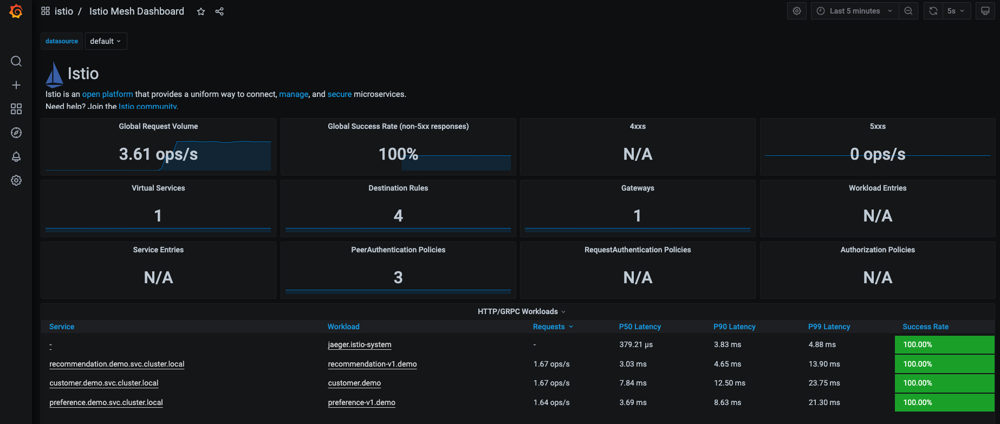
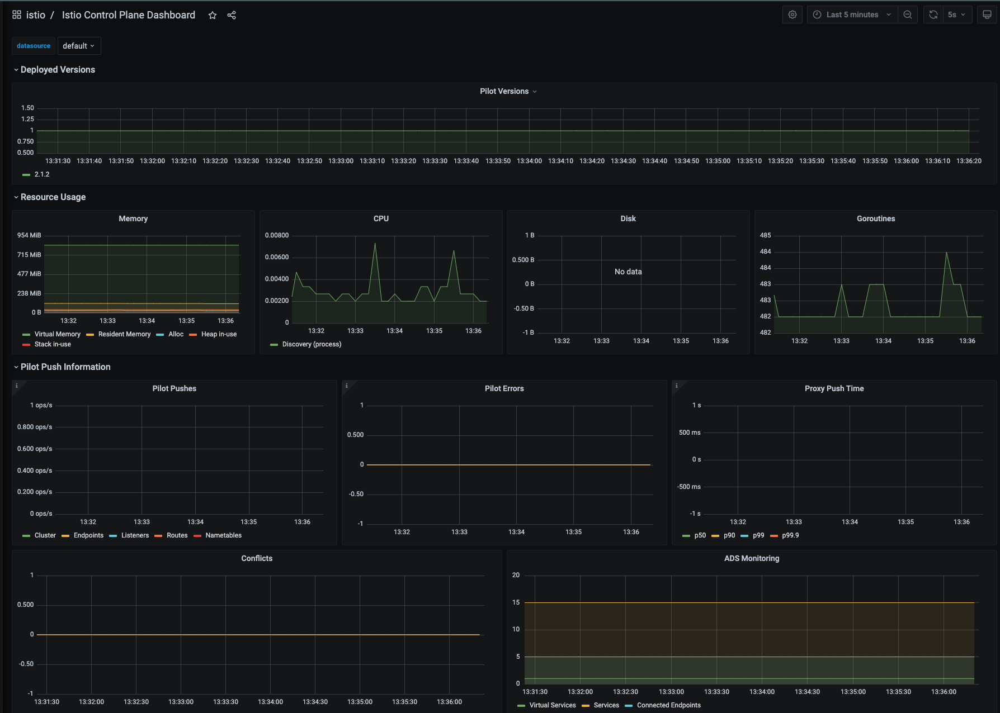
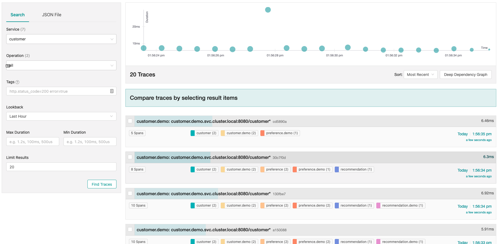
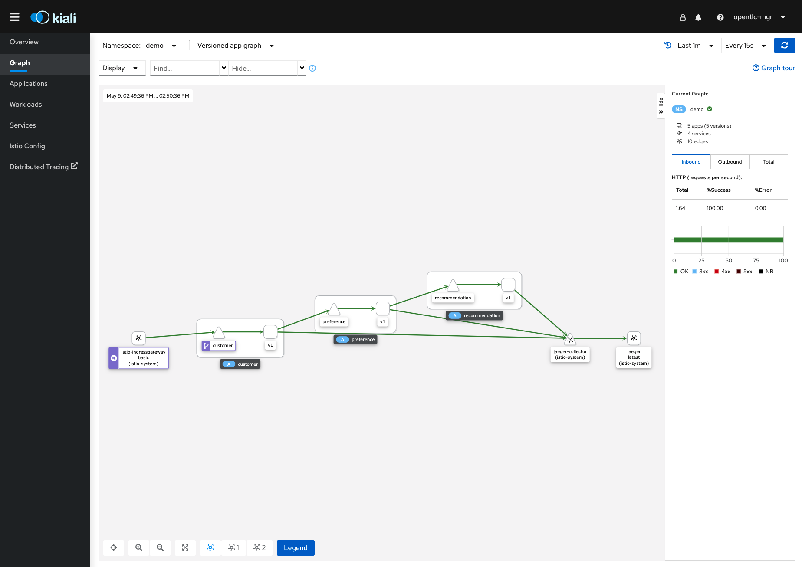

# Observabilité

Commençons par générer du traffic au niveau de l'application en utilisant le scripts suivant.
```
./scripts/run.sh $GATEWAY_URL/customer
``` 

## Observabilité

__NOTE:__  Les url pour les différent dashboards requis pous la section observabitlité se trouve au niveau de `Networking -> Routes`


### Grafana & Prometheus.
Par défautl la plateforme nous donne du monitoring avec `Prometheus` et `Grafana

#### Grafana

Plusieurs dashboard sont accessible par default.

Example 1: Istio mesh


Example 2: Istio control plane


#### Prometheus

* Il existe maintant 2 Prometheus. Les deux permettent de scpecifier des metrics customs.

1. Celui de la plateform Openshift ou nous pouvons executer des commande de type:
    ```
    container_memory_rss{namespace="demo",container=~"customer|preference|recommendation"}
    ```


2. Celui d'Istio, ou nous pouvons avoir des métrics Istio.
    ```
    istio_requests_total{destination_service="recommendation.demo.svc.cluster.local"}
    ```

### Tracing

Avec Istio nous avons installé `Jaeger` pour le Open Tracing. Comme nous service utilise les librairing d'open tracing, nous pouvons les capters en utilisans `Jaeger`.  Istio envoie automatiquement les donn/e de tracage connecter a `Jaeger`.




### Kiali

Kiali utilise le données qui sont fourni par Istio et OpenShift pour générer la visualisation. Comme c'est un service nous avons aucun changement a faire èa Istio ou OpenShift une fois l'operator installé.


#### Service Graph


A partir de Kiali on peut avoir plein information sur:
* Les Application
* Les Workloads
* Les Services

---
Maintenant que nous avons les outils d'observation en place, regardons comment controler le traffic à l'intérieur de la Mesh.

[Démo Contrôle du Traffic](traffic-control.md)