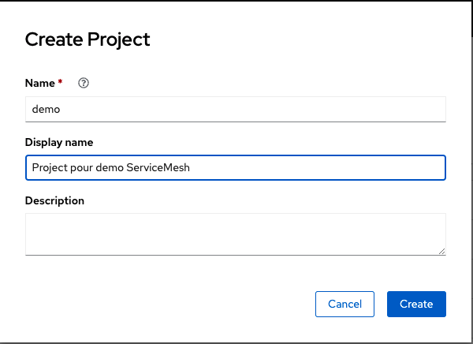

# Déploiement des Services

Pour commencez nous devons mettre en place un project dans OpenShift.

Les service utilisé viendrons d'images qui se trouve sur [Quay.io](quay.io/rhdevelopers).
* [Customer](https://quay.io/rhdevelopers/istio-tutorial-customer)
* [Preference](https://quay.io/rhdevelopers/istio-tutorial-preference)
* [Recommendation](https://quay.io/rhdevelopers/istio-tutorial-recommendation)


## Mise en place du projet.
1. Créer un project avec les infirmations suivantes.
    * `Nom:` demo
    * `Display:` Project pour demo ServiceMesh

    


2. Ajoutez le project à la Mesh. Pour ce faire nous devons l'ajouter au `Member Roll`.

À partir du UI:
* Allez dans `Intaslled Operator`
* Dans le project `istio-system`, selectionner l'operator `Red Hat OpenShift Service Mesh`
* Allez dans l'onglet `Istio Servicw Mesh Member Roll`
* Selectionnez `SMMR default`
* En haut a droite, sélectionnez `Edit Service MeshMemberRoll`.
* Dans le yaml, sous la _members_ dans spec, ajouté le nom du projet: __demo__ 
    ```
    ...
    spec:
    members:
        - demo
    status:
    ...
    ```

* __Save__.
___

## Déploiement de Customer

* Déploiement de l'application
    ```
    oc create -f manifest/kubernetes/customer/deployment.yaml -n demo
    ```
* Création du service
    ``` 
    oc create -f manifest/kubernetes/customer/service.yaml -n demo
    ```
* Nous devons exposer le service customer avec un Gateway, pour permettre les accès en ingress aux l'utilisateurs.
    ``` 
    oc create -f manifest/kubernetes/customer/gateway.yaml -n demo
    ```

* Récupérons URL du gateway dans un variable pour facililer les intéreaction plus tard.
    ``` 
    export GATEWAY_URL=$(oc get route istio-ingressgateway -n istio-system -o=jsonpath="{.spec.host}")
    ```

* Test
    ``` 
    curl $GATEWAY_URL/customer
    ```

    Résultat
    ```
    customer =``` UnknownHostException: preference
    ```

* Accédons les logs pour voir l'erreur.
    ``` 
    stern "customer-\w" -c customer
    ```
___

## Déploiement de Preference 

* Déploiement de l'application
    ```
    oc create -f manifest/kubernetes/preference/deployment.yaml -n demo
    ```
* Création du service
    ``` 
    oc create -f manifest/kubernetes/preference/service.yaml -n demo
    ```

* Test
    ``` 
    curl $GATEWAY_URL/customer
    ```

    Résultat
    ```
    customer =``` Error: 503 - preference =``` UnknownHostException: recommendation
    ```

* Accédons les logs pour voir l'erreur.
    ``` 
    stern "preference-\w" -c preference
    ```
___

## Déploiement de Recommendation 

* Déploiement de l'application
    ```
    oc create -f manifest/kubernetes/recommendation/deployment.yaml -n demo
    ```

* Création du service
    ```
    oc create -f manifest/kubernetes/recommendation/service.yaml -n demo
    ```

* On peut maintenant faire un test en essayant d'accéder le endpoint.
    ```
    curl $GATEWAY_URL/customer
    ```

    Résultat
    ```
    customer =``` preference =``` recommendation v1 from 'recommendation-v1-6cf5ff55d9-7zbj8': 1
    ```

* Accédons les logs pour voir l'erreur.
    ``` 
    stern "recommendation-\w" -c recommendation
    ```


---
Maintenant que nous avons des application dans notre projet, regardons les différents outils qui observe la Service Mesh.

[Démo Obervabilité](observability.md)
