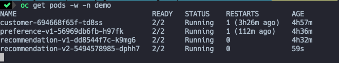
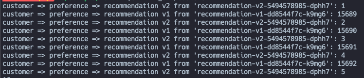

# Contrôle du traffic

## Règles simple de traffic

Déployons une deuxième version du service `recommendation`.

```
oc apply -f manifest/kubernetes/recommendation/deployment-v2.yaml -n demo
```



:zap: Par défault, OpenShift utilise le principle round-robin pour la distribution de la charge entre les 2 sapplications.



---
_OPTIONEL_ Scale la v2 à 2 replicas et regardons la distriution changer.

```
oc scale --replicas=2 deployment/recommendation-v2 -n demo
```
```
oc scale --replicas=1 deployment/recommendation-v2 -n demo
```
---

## Changer la distribution avec Istio

* Créons une destination rule.
    ```
    oc apply -f manifest/istio/destinationrule-recommendation_v1_v2.yaml
    ```

__Envoyer tout le traffic vers v2__

* Créons un virtual service qui envoi tout le traffic vers v2.
    ```
    oc apply -f manifest/istio/virtualservice-recommendation_v2.yaml
    ```
* Test
    ```
    ./scripts/run.sh $GATEWAY_URL/customer
    ```

    Résultat
    _On devrait seulement voir v2_

__Envoyer tout le traffic vers v1__

* Créons un virtual service qui envoi tout le traffic vers v1.
    ```
     oc replace -f manifest/istio/virtualservice-recommendation_v1.yaml
    ```

    Résultat
    _On devrait seulement voir v1_

__Retour au round robin__
* Deletons le virtual service
    ```
    oc delete virtualservice recommendation -n demo
    ```

    Résultat
    _On devrait voir v1 et v2_

__Déploiement Canary - Partage du traffic entre v1 et v2__

* Créons un virtual service qui envoi 80% du traffic à v1 et 20% à v2
    ```
    ooc apply -f manifest/istio/virtualservice-recommendation_v1_v2.yaml.yaml -n demo
    ```

    Résultat
    _On devrait maintenant voir  v1 et v2 dans une proportion 80-20_

:zap: On peut jouer avec les proportion en edidant le fichier et voir ce qui arrive.

:construction: __CLEAN UP__
```
./scripts/cleanup-routing.sh
```

---

## Régles de traffic plus avancé.

__Routing intelligent basé sur le user-agent header__

:information_source: Le header "user-agent" est ajouté au OpenTracing baggage dans le service Customer. Il est par la suite propagé automatiquement à tout les downstream services.

* Créons la destination rule
    ```
    oc apply -f manifest/istio/destinationrule-recommendation_v1_v2.yaml
    ```
* Créons le virtual service
    ```
     oc apply -f manifest/istio/virtualservice-recommendation-browser.yaml
    ```

* Test 1
    ```
    curl -A Safari $GATEWAY_URL/customer
    ```

    Résultat
    ```
    customer => preference => recommendation v2 from .....
    ```

* Test 2
    ```
    curl -A Firefox $GATEWAY_URL/customer
    ```

    Résultat
    ```
    customer => preference => recommendation v1 from .....
    ```

:construction: __CLEAN UP__
```
./scripts/cleanup-routing.sh
```

---

__Mirroring__

Le `mirroring` du traffic, aussi appelé `shadowing` est un concept puissant dans istio. IL permet aux équipes de développement d'apporter des nouvelles fonctionnalitées en production en limitant les risques. En effet le `mirroring` consiste à envoyer une copie du traffic en temps réel à un service sélectionné, sans impater le service primaire.

* Créons la destination rule
    ```
    oc apply -f manifest/istio/destinationrule-recommendation_v1_v2.yaml
    ```

* Créons le virtual service
    ```
     oc apply -f manifest/istio/virtualservice-recommendation-mirror_v1_v2.yaml
    ```
* Test
    ```
    curl $GATEWAY_URL/customer
    ```

    Résultat
    ```
    customer => preference => recommendation v1 from .....
    ```

* Regardons les logs de v2: Un ligne devrait s'ajouté dans le logs.
    ```
    oc logs -f `oc get pods -n demo |grep recommendation-v2|awk '{ print $1 }'` -c recommendation -n demo
    ```

:construction: __CLEAN UP__
```
./scripts/cleanup-routing.sh
```
---

__Load Balancer__

Commen mentionné, OpenShift utilise la politique de Round Robin par défaut. Avec le Service Mesh nous pouvons facilement le changer. Il suivi d'introduire la bonne destination rule.

```
oc apply -f manifest/istio/destinationrule-recommendation-lb_random.yaml
```

:zap: En scalant la version v2 à 2 replicas on voit encore mieux le random.

:construction: __CLEAN UP__
```
./scripts/cleanup-routing.sh
```

---
Maintenant regardons la résilience des service.

[Démo Résilience des services](resiliency.md)